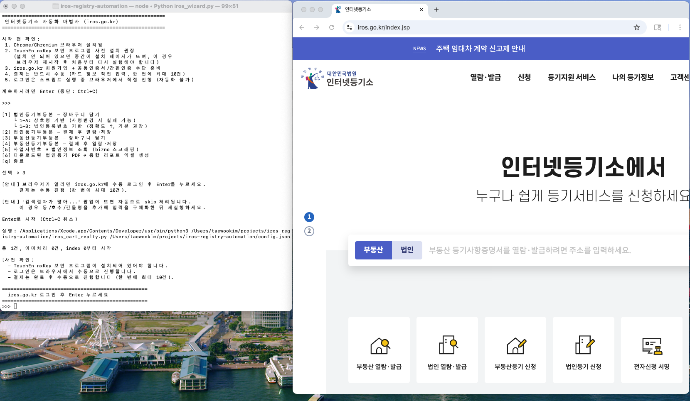
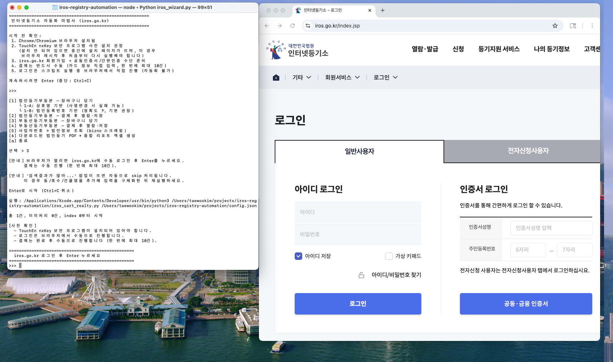

# IROS 등기부등본 자동화

**법인/부동산 등기부등본**을 자동으로 장바구니에 담고, 결제 후 열람·저장까지 자동화합니다.
IROS(인터넷등기소, https://www.iros.go.kr)에서 제공하는 법인/부동산 등기부등본을 대량으로 발급받을 때 유용합니다.

> **로그인과 결제는 수동입니다.** 인증/카드 정보는 사람이 직접 입력해야 합니다.
> **본 도구는 자동 발급 이외의 기능(결제 자동화 등)을 제공하지 않습니다.**

> **주 용도는 법인등기부등본 대량 발급**입니다. 법인은 **페이지당 10건** 결제 제한이 있어서 수백~수천 건을 뗄 때 자동화가 큰 효용이 있습니다. ⭐ **10건 이상 한 번에 결제하는 방법을 아시는 분은 제보 부탁드려요** (이메일 / GitHub Issues — 하단 [문의](#문의) 참고).
>
> **부동산은 자동화가 덜 필요할 수 있습니다.** IROS 웹 UI에서 **로그인 시 10만원 미만 일괄 결제**와 **일괄열람출력**(한 페이지에 뜬 건들을 한 번에 저장)이 기본 제공되므로 건수가 많지 않으면 **수동이 더 빠르고 안전**합니다. 많은 주소 리스트를 반복 조회할 때만 자동화(부동산 장바구니)가 유리합니다.

---

## 5분 퀵스타트

```bash
# 1. 의존성 설치
pip install -r requirements.txt
playwright install chromium

# 2. 설정 파일 준비
cp config.json.example config.json

# 3. 마법사 실행
python3 iros_wizard.py
```

실행하면 메뉴가 뜨고, 원하는 작업(법인/부동산 장바구니·다운로드)을 번호로 고르면 됩니다.

> **명령 입력 주의**: 스크립트는 **반드시 `python3` 접두사와 함께** 실행합니다.
> `iros_wizard.py`만 입력하면 `command not found` 오류가 납니다. (`.py`는 실행 파일이 아니라 파이썬 스크립트이기 때문)
> ```bash
> python3 iros_wizard.py          # O
> python3 iros_download_realty.py # O
> iros_wizard.py                  # X  (command not found)
> ```

---

## TouchEn nxKey 사전 설치 (중요)

IROS는 보안 프로그램 **TouchEn nxKey**를 요구합니다. 설치되지 않은 채로 스크립트를 실행하면 중간에 설치 페이지가 뜨고, **설치 후 브라우저를 재시작하여 처음부터 다시 실행**해야 합니다.

- 사전 설치: IROS 로그인 페이지 접속 → 안내에 따라 TouchEn nxKey 설치 → PC 재시작
- 본 스크립트는 설치 페이지가 감지되면 자동으로 중단하고 안내 메시지를 출력합니다

---

## 사전 준비 체크리스트

| 항목 | 비고 |
|------|------|
| Chrome / Chromium 설치 | Playwright가 자동 관리 (`playwright install chromium`) |
| TouchEn nxKey 사전 설치 | 위 섹션 참고 — 반드시 **먼저** 설치 |
| iros.go.kr 회원가입 | https://www.iros.go.kr |
| 공동인증서 / 간편인증 | 로그인 시 사용 |
| 카드 | 결제(수동) 시 필요. **법인: 페이지당 10건 / 부동산: 로그인 시 10만원 미만 일괄** |
| Python 3.10 이상 | |

---

## 두 가지 워크플로우

### 법인등기부등본 (주 용도)

```
1) 상호명/법인등록번호 준비 → 2) 장바구니 → 3) 결제(수동, 페이지당 10건/회) → 4) 열람·저장
```

- 장바구니: `iros_cart_by_corpnum.py` (법인등록번호 기반, 정확도 높음) 또는 `iros_cart.py` (상호명 기반)
- 열람·저장: `iros_download.py`
- 결제가 **페이지당 10건**으로 제한되어 있어 100건 이상 발급 시 브라우저 앞에 앉아 10회, 30회, 100회씩 결제 반복이 필요합니다. 자동화가 가장 큰 효용을 내는 구간.
- ⭐ **10건을 초과해 한 번에 결제하는 방법을 찾은 분은 [문의](#문의)로 공유 부탁드립니다.**

### 부동산등기부등본 (수동 권장)

```
1) 주소/동호수 JSON 준비 → 2) 장바구니 → 3) 결제(수동, 10만원 미만 일괄) → 4) 일괄열람출력/일괄저장
```

- 장바구니: `iros_cart_realty.py`
- 열람·저장: `iros_download_realty.py`
- IROS 웹에서 **로그인 시 10만원 미만 일괄 결제**와 **일괄열람출력·일괄저장** 버튼이 기본 제공되어, 건수가 적으면 브라우저에서 바로 처리하는 게 빠릅니다.
- 주소 리스트가 **수십 건 이상**이고 자동 검색·장바구니 담기가 필요할 때만 이 도구를 쓰세요.

마법사(`iros_wizard.py`)에서 메뉴로 바로 실행 가능합니다.

---

## 부동산 입력 JSON 포맷

`data/iros_realties.json` (또는 `config.json`의 `realty_list` 경로) — JSON 배열:

```json
[
  {
    "label": "우리집_아파트",
    "address": "서초대로 219",
    "unit": "101동 1203호",
    "building_name": ""
  },
  {
    "label": "상가_건물",
    "address": "세종대로 110",
    "unit": "",
    "building_name": "시청별관"
  },
  {
    "label": "토지",
    "address": "종로 1",
    "unit": "",
    "building_name": ""
  }
]
```

| 필드 | 설명 | 필수 |
|------|------|------|
| `label` | 로그/파일명 식별자 | O |
| `address` | 지번 또는 도로명 주소 | O |
| `unit` | 동/호수 (집합건물) — 권장 | 아파트·오피스텔 등은 사실상 필수 |
| `building_name` | 건물명 | 선택 |

> 집합건물(아파트/오피스텔)인데 동·호수를 비우면 "검색결과가 많아 소재지번 확인이 어려울 수 있습니다" 팝업이 나와서 skip 처리됩니다. 이 경우 **동/호수 또는 건물명을 추가**해서 재실행하세요.

샘플: `data/iros_realties.example.json`

---

## 설정 (config.json)

| 키 | 설명 | 기본값 |
|----|------|--------|
| `companies_list` | 상호명 기반 검색 목록 | `./data/iros_companies.json` |
| `corpnum_list` | 법인등록번호 기반 검색 목록 | `./data/iros_corpnums.json` |
| `realty_list` | 부동산 검색 목록 | `./data/iros_realties.json` |
| `save_dir` | 법인 PDF 저장 경로 | `~/Downloads/등기부등본` |
| `realty_save_dir` | 부동산 PDF 저장 경로 | `~/Downloads/부동산등기부등본` |
| `report_output` | 법인정보 종합 리포트 엑셀 | `./output/법인정보_종합리포트.xlsx` |
| `excel_path` | bizno 조회용 원본 엑셀 | `./data/고객리스트.xlsx` |

---

## 마법사 메뉴

```
[1] 법인등기부등본 — 장바구니 담기
    └ 1-A: 상호명 기반
    └ 1-B: 법인등록번호 기반 (기본 권장)
[2] 법인등기부등본 — 결제 후 열람·저장
[3] 부동산등기부등본 — 장바구니 담기
[4] 부동산등기부등본 — 결제 후 열람·저장
[5] 사업자번호 → 법인정보 조회 (bizno 스크래핑)
[6] 다운로드된 법인등기 PDF → 종합 리포트 엑셀 생성
[q] 종료
```

각 메뉴 선택 시:
- 입력 파일이 없으면 경로/형식을 안내합니다 (부동산은 1건 직접 입력 옵션 제공).
- 브라우저가 뜨면 IROS에 수동 로그인 후 Enter.
- 결제 단계는 결제대상목록이 뜨면 사람이 직접 카드 결제.

---

## 상세 실행 가이드 (처음 사용자용)

처음 사용할 때 어디서 터미널을 보고 어디서 브라우저를 봐야 하는지 헷갈릴 수 있어서 단계별로 정리했습니다. **창 두 개(터미널 + 브라우저)가 동시에 열립니다.** 아래 표시된 대로 포커스를 왔다갔다 하면 됩니다.

### 스텝 1 — 터미널에서 마법사 시작

```bash
cd ~/projects/iros-registry-automation
python3 iros_wizard.py
```

체크리스트가 출력됩니다. 내용 확인 후 **터미널에서 Enter**.

### 스텝 2 — 터미널에서 메뉴 선택

예: 부동산 장바구니 → `3` 입력 후 Enter. 법인(법인등록번호 기반) → `1` → `b`.

### 스텝 3 — 브라우저가 자동으로 열림 → IROS 로그인

Playwright가 Chromium 창을 띄우고 `iros.go.kr` 홈페이지를 엽니다.



여기서 직접 상단 **로그인** 버튼을 누르거나, 스크립트가 로그인 페이지로 유도합니다. 로그인 화면:



- **일반사용자(아이디 로그인)**: 회원가입 시 만든 ID/PW.
- **인증서 로그인**: 공동인증서(구 공인인증서) / 금융인증서 / 간편인증.

로그인에 성공하면 IROS 상단 메뉴에 내 이름이 표시됩니다. **이 시점에서 터미널 창으로 돌아가서 Enter를 누르세요.** 터미널엔 이렇게 떠 있습니다:

```
==================================================
  iros.go.kr 로그인 후 Enter 누르세요
==================================================
>>>
```

> **중요**: 터미널에서 Enter를 치기 전까지 스크립트는 기다리고 있습니다. 브라우저에서 로그인만 하고 터미널을 까먹으면 영원히 진행이 안 됩니다.

### 스텝 4 — 자동 처리 (지켜보기만)

스크립트가 브라우저를 조종해서:
- 부동산: 주소 입력 → 검색 → 소재지번 선택 → 용도(열람)/등기기록유형(전부)/미공개 → 장바구니
- 법인: 회사명/법인등록번호 입력 → 말소사항포함 → 장바구니

**터미널에 진행 상황이 한 줄씩 찍히는 걸 관찰**하시면 됩니다. 건별로 `✓` 또는 `- skip` 또는 `✗` 마크가 붙습니다.

### 스텝 5 — 자동으로 결제대상목록 페이지로 이동

모든 건이 처리되면 브라우저가 자동으로 `결제대상목록` 페이지로 넘어갑니다. 터미널엔:

```
  ★ 결제대상: 1건 - 페이지당 최대 10건 결제 (법인)
>>> 결제 완료 후 Enter (브라우저 닫힘)
```

### 스텝 6 — 브라우저에서 직접 결제 (수동, 카드)

**포커스를 브라우저로 이동해서** 결제대상목록에서:
1. 결제할 항목 선택 → 결제 버튼 (법인: **페이지당 10건**씩 결제)
2. 카드 정보 입력(카드번호, 유효기간, CVC, 비밀번호)
3. 결제 승인

결제가 끝나면 **다시 터미널로 돌아가서 Enter**. 브라우저가 자동으로 닫힙니다.

> 법인은 현재 **페이지당 10건** 단위로만 결제됩니다. 초과분은 10건 단위로 여러 회 나눠 결제 → 새로고침 → 나머지 10건 순으로 반복하세요. 터미널 Enter는 전체 결제가 다 끝난 뒤 한 번만 누릅니다.
> ⭐ **10건 이상 한 번에 결제하는 방법을 아신다면 [문의](#문의)로 알려주세요** — 문서/코드에 반영하겠습니다.

### 스텝 7 — 열람·저장 (메뉴 2 또는 4)

결제가 끝난 항목은 `신청결과 확인` 페이지에서 열람/PDF 저장이 가능합니다. 마법사를 다시 실행하고 **메뉴 2(법인) 또는 4(부동산)** 선택:

```bash
python3 iros_wizard.py
# 체크리스트 Enter → 2(법인, 받을 건수) 또는 4(부동산, 최대 배치 수) 선택 → Enter
```

여기서도 **브라우저 로그인 → 터미널 Enter** 흐름이 똑같이 한 번 반복됩니다. 이후는 자동으로 열람 → 저장 → 파일명 정리:
- 법인: `~/Downloads/등기부등본/{회사명}.pdf` (건별 저장)
- 부동산: `~/Downloads/부동산등기부등본/realty_bulk_{YYYYMMDD_HHMMSS}_{배치번호}.pdf` (페이지 단위 일괄 PDF)

### 언제 터미널 / 언제 브라우저 요약

| 시점 | 포커스 | 할 일 |
|------|------|-------|
| 마법사 시작 | 터미널 | 체크리스트 Enter, 메뉴 번호 입력 |
| 브라우저 자동 오픈 | 브라우저 | IROS 로그인 |
| "로그인 후 Enter" 프롬프트 | 터미널 | Enter 한 번 |
| 자동 검색/담기 진행 중 | 터미널 | 로그 관찰만 (건드리지 말 것) |
| "결제대상: N건" 안내 | 브라우저 | 카드 결제 (법인: 페이지당 10건 / 부동산: 10만원 미만 일괄) |
| 결제 완료 후 | 터미널 | Enter → 브라우저 닫힘 |

> **TouchEn nxKey 설치 페이지가 뜨면** 스크립트가 자동 중단되고 터미널에 `[중단]` 메시지가 나옵니다. TouchEn nxKey 설치 → 브라우저 재시작 → 스크립트 처음부터 다시 실행하세요.

---

## OS별 안내

macOS / Linux에서 개발·검증된 스크립트입니다. **Windows에서도 원칙적으로 동작할 것으로 예상**되지만 실제 테스트는 진행되지 않았습니다.

**Windows 실행 시 참고 사항** (미검증):

- Python 3.10+ 설치 후 동일하게 `pip install -r requirements.txt` / `playwright install chromium`
- 명령은 `python3` 대신 `python` 사용 권장
- `~/Downloads/등기부등본`은 Windows에선 `%USERPROFILE%\Downloads\등기부등본`으로 해석되므로 `config.json`에 `C:/Users/.../Downloads/등기부등본`처럼 명시적으로 지정 권장
- **법인정보 PDF 추출(`corp_info_extract.py`)에 필요한 도구**:
  - `pdftotext`: [poppler for Windows](https://github.com/oschwartz10612/poppler-windows/releases) 다운로드 → `bin` 폴더를 PATH에 추가
  - (선택) `tesseract`: [UB Mannheim Tesseract](https://github.com/UB-Mannheim/tesseract/wiki) — 한국어 언어팩(`kor`) 포함
- 터미널은 **PowerShell** 또는 **Windows Terminal** 권장 (한글 출력)

---

## 고급 사용 (스크립트 직접 실행)

마법사를 거치지 않고 개별 스크립트를 직접 실행할 수 있습니다.

### 법인 장바구니 — 법인등록번호 기반 (권장)

```bash
python3 iros_cart_by_corpnum.py [config.json]
```

입력: `data/iros_corpnums.json` — `{"법인등록번호": "회사명", ...}` 형식.
로그: `logs/cart_corpnum_log.json`

### 법인 장바구니 — 상호명 기반

```bash
python3 iros_cart.py [config.json] [시작인덱스]
```

입력: `data/iros_companies.json` — `["회사A", "회사B"]` 형식.
사명변경/특수문자로 실패 가능 — 실패분은 법인등록번호 기반으로 재시도 권장.

### 법인 열람·저장

```bash
python3 iros_download.py [config.json] [건수]
```

저장: `~/Downloads/등기부등본/회사명.pdf` (파일명은 상호명 매칭).

### 부동산 장바구니

```bash
python3 iros_cart_realty.py [config.json] [시작인덱스]
```

### 부동산 열람·저장

```bash
python3 iros_download_realty.py [config.json] [max_batches]
```

`max_batches` 기본 99. 한 페이지 단위로 일괄열람출력 → 일괄저장 → 다음 페이지 순으로 반복합니다.
저장: `~/Downloads/부동산등기부등본/realty_bulk_{YYYYMMDD_HHMMSS}_{배치번호}_{순번}.pdf`
(일괄저장 결과 파일명은 IROS 내부 값 기반입니다. 상호/주소 매칭이 필요하면 내용으로 식별하세요.)

> 부동산은 건수가 적으면 IROS 웹에서 직접 [일괄열람출력] → [일괄저장]을 누르는 것만으로도 충분합니다. 이 스크립트는 주소 리스트가 많아 **장바구니 단계 자동화가 필요한 경우** 사용하세요.

### bizno 스크래핑 (사업자등록번호 → 법인정보)

```bash
python3 bizno_scrape.py [config.json]
```

엑셀에서 사업자등록번호를 읽어 bizno.net에서 회사명/법인등록번호/휴폐업 상태를 조회합니다.
결과: `data/bizno_results.json`, `data/iros_companies.json`

### 법인정보 종합 리포트 생성

```bash
python3 corp_info_report.py [config.json]
```

bizno 결과 + 다운로드 상태 + 등기부등본 PDF 추출 내용을 엑셀로 종합합니다.
PDF 추출은 내부적으로 `corp_info_extract.py`를 사용합니다.

**사전 요구사항**: `pdftotext` (poppler). macOS: `brew install poppler` / Ubuntu: `sudo apt install poppler-utils`. 스캔 이미지 PDF는 자동으로 Tesseract OCR로 fallback — `pip install pytesseract pdf2image` + `brew install tesseract tesseract-lang` (또는 `sudo apt install tesseract-ocr tesseract-ocr-kor`).

---

## 중단 후 재개

모든 스크립트는 로그 파일에 진행 상황을 저장하므로 중단 후 재실행하면 이미 처리된 건을 건너뜁니다.

```bash
python3 iros_cart_by_corpnum.py       # 자동 이어하기
python3 iros_cart.py config.json 50   # 상호명 기반 — 50번부터
python3 iros_download.py 220          # 이미 받은 파일은 건너뜀
```

로그 초기화:

```bash
echo '{"completed":[],"failed":[],"skipped":[]}' > logs/cart_realty_log.json
```

---

## 트러블슈팅

| 증상 | 원인 | 해결 |
|------|------|------|
| 중간에 "보안 프로그램 설치" 페이지 | TouchEn nxKey 미설치 | nxKey 설치 후 브라우저 재시작, 스크립트 재실행 |
| "검색결과가 많아..." 팝업 반복 | 주소만 입력, 동/호수 없음 | 동·호수 또는 건물명 추가 |
| 회사 검색 안됨 | 사명변경/특수문자 | 법인등록번호 기반으로 재시도 |
| 열람 버튼 못 찾음 | 결제 안 됨 | 결제대상목록에서 결제 확인 |
| 브라우저 멈춤 (약 100건마다) | IROS 서버 부하 | 브라우저 닫고 재실행 (이어하기 지원) |
| PermissionError: ~/Downloads | macOS 보안 정책 | 시스템 설정 > 개인정보 보호 > 전체 디스크 접근 허용 |

---

## 파일 구조

```
iros-registry-automation/
├── README.md
├── config.json.example
├── requirements.txt
├── iros_wizard.py                 # 인터랙티브 마법사 (일반 사용자용 진입점)
├── iros_cart.py                   # 법인 장바구니 (상호명 기반)
├── iros_cart_by_corpnum.py        # 법인 장바구니 (법인등록번호 기반, 권장)
├── iros_download.py               # 법인 열람/저장
├── iros_cart_realty.py            # 부동산 장바구니
├── iros_download_realty.py        # 부동산 열람/저장
├── bizno_scrape.py                # 사업자번호 → 법인정보 조회
├── corp_info_extract.py           # 법인등기 PDF 텍스트 추출
├── corp_info_report.py            # 법인정보 종합 리포트 엑셀
├── data/
│   ├── iros_realties.example.json
│   └── ... (개인 데이터, gitignore)
├── logs/                          # 진행 상황 (gitignore)
└── output/                        # 결과물 (gitignore)
```

---

## 주의사항

- `config.json`, `data/`, `logs/`, `output/`는 `.gitignore`에 포함됩니다. 개인 정보는 커밋되지 않습니다.
- IROS 결제는 반드시 사람이 직접 진행합니다. **법인: 페이지당 최대 10건 / 부동산: 로그인 시 10만원 미만 일괄**.
- bizno.net 과부하 방지를 위해 요청 간 자동 대기합니다 (건당 약 2초).
- GitHub: https://github.com/challengekim/iros-registry-automation

---

## 문의

버그 제보 / 기능 제안 / 사용 질문 / ⭐ **법인 10건 초과 일괄 결제 방법 공유** 모두 환영합니다.

- **이메일**: kimtaewoo1201@gmail.com
- **GitHub Issues**: https://github.com/challengekim/iros-registry-automation/issues (권장 — 다른 사용자도 답변을 검색할 수 있음)
